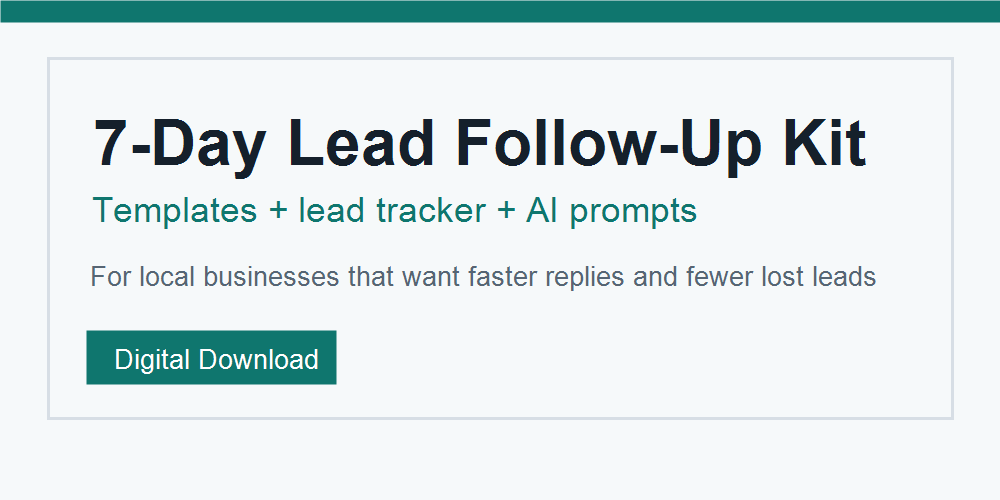

# SoftJunk Lead Kit

A $5 lead follow-up kit and custom follow-up sequence for small businesses that get leads from forms, DMs, email, ads, referrals, or calls.

## Buy or Try

- Buy for $5: https://paypal.me/softjunk/5USD
- Scan PayPal QR: https://trungcodeer.github.io/softjunk-lead-kit/pay-qr.html
- GitHub funding link: https://github.com/trungcodeer/softjunk-lead-kit/blob/main/.github/FUNDING.yml
- Estimate missed lead value: https://trungcodeer.github.io/softjunk-lead-kit/lead-loss-calculator.html
- Get a free preview: https://trungcodeer.github.io/softjunk-lead-kit/free-preview.html
- Build a custom order note: https://trungcodeer.github.io/softjunk-lead-kit/agent-order.html
- After-payment handoff: https://trungcodeer.github.io/softjunk-lead-kit/after-pay.html

Use PayPal note `Lead Follow-Up Kit` for the ZIP. For a custom sequence, use the free preview or agent order path to copy the PayPal note before paying.

## Try It

- Free generator: https://trungcodeer.github.io/softjunk-lead-kit/
- Lead loss calculator: https://trungcodeer.github.io/softjunk-lead-kit/lead-loss-calculator.html
- Free preview builder: https://trungcodeer.github.io/softjunk-lead-kit/free-preview.html
- AI agent order path: https://trungcodeer.github.io/softjunk-lead-kit/agent-order.html
- Payment page: https://trungcodeer.github.io/softjunk-lead-kit/pay.html
- After-payment handoff: https://trungcodeer.github.io/softjunk-lead-kit/after-pay.html
- Dental template: https://trungcodeer.github.io/softjunk-lead-kit/dental-follow-up.html
- Appointment setting template: https://trungcodeer.github.io/softjunk-lead-kit/appointment-setting-follow-up.html
- Med spa template: https://trungcodeer.github.io/softjunk-lead-kit/med-spa-follow-up.html
- Tutoring template: https://trungcodeer.github.io/softjunk-lead-kit/tutoring-follow-up.html
- HVAC template: https://trungcodeer.github.io/softjunk-lead-kit/hvac-lead-follow-up.html
- Roofing estimate template: https://trungcodeer.github.io/softjunk-lead-kit/roofing-estimate-follow-up.html
- Real estate lead template: https://trungcodeer.github.io/softjunk-lead-kit/real-estate-lead-follow-up.html
- Plumbing lead template: https://trungcodeer.github.io/softjunk-lead-kit/plumbing-lead-follow-up.html
- AI-readable offer summary: https://trungcodeer.github.io/softjunk-lead-kit/llms.txt
- Machine-readable offers: https://trungcodeer.github.io/softjunk-lead-kit/offers.json
- Agent offer manifest: https://trungcodeer.github.io/softjunk-lead-kit/agent-offer.json
- Product feed: https://trungcodeer.github.io/softjunk-lead-kit/product-feed.json
- RSS feed: https://trungcodeer.github.io/softjunk-lead-kit/feed.xml
- Well-known offer: https://trungcodeer.github.io/softjunk-lead-kit/.well-known/softjunk-offer.json
- OpenAPI discovery: https://trungcodeer.github.io/softjunk-lead-kit/.well-known/openapi.yaml
- Share kit: https://trungcodeer.github.io/softjunk-lead-kit/share-kit.html
- Share kit JSON: https://trungcodeer.github.io/softjunk-lead-kit/share-kit.json

## Buy

There are two $5 options:

1. Digital kit: 7-day follow-up guide, templates, tracker CSV, and AI prompts.
2. Custom sequence: Day 0, 1, 3, 5, and 7 messages written for one business, plus no-show and price-objection replies.

Pay here:
https://paypal.me/softjunk/5USD

For the digital kit, add the PayPal note `Lead Follow-Up Kit`.

For the custom sequence, fill the free generator, click `Copy PayPal note`, and paste that intake note into PayPal before paying.

## Delivery

The product ZIP is not public in this repository. Buyers pay through PayPal and receive fulfillment manually using the email shown in the PayPal transaction.

Custom sequences are delivered same day after the payment appears in PayPal.
